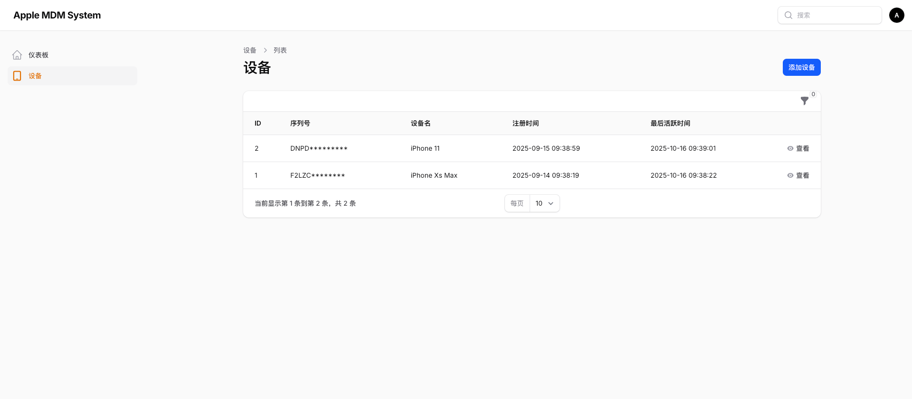
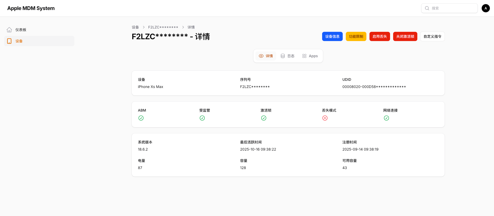
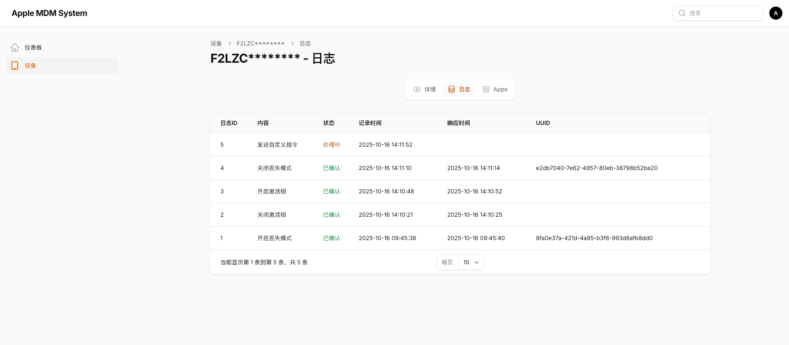
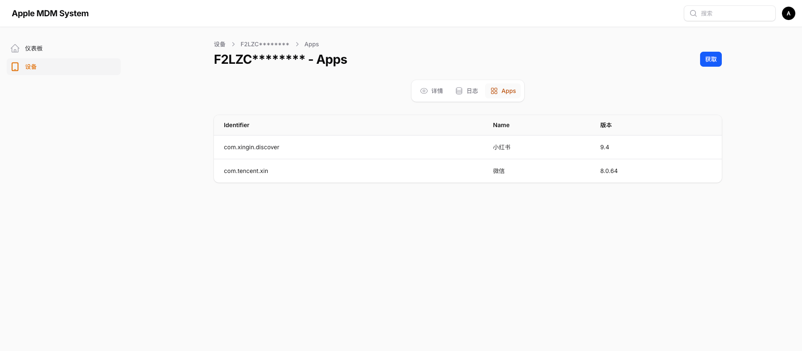
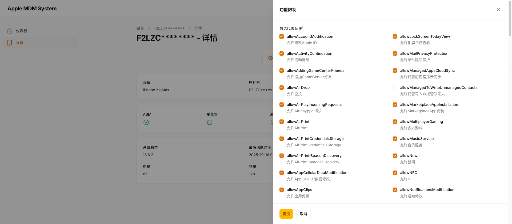
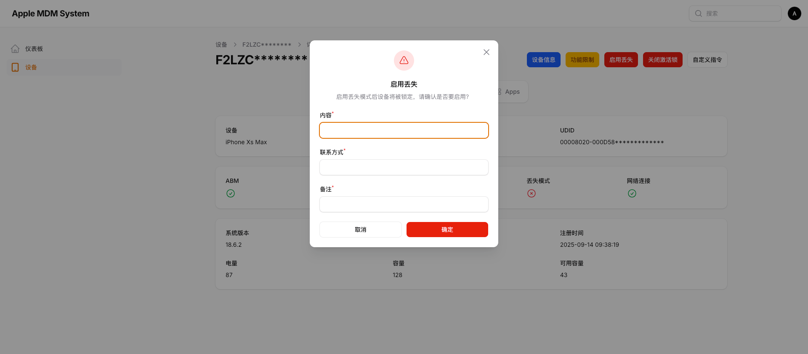

# Apple MDM System

## 📖项目简介
Apple MDM System 是一个基于 Laravel 与 Filament Admin 开发的苹果移动设备管理系统（Mobile Device Management，简称 MDM）。
通过本系统，您可以快速对接苹果官方的 MDM 服务，实现设备注册、策略下发、指令控制、DEP 自动注册等完整的 MDM 管理流程。

系统目标是帮助企业、租赁行业、教育机构等快速搭建自己的 Apple MDM 平台，实现对 iPhone、iPad、Mac 等设备的集中化管理。

***

## ✨功能亮点
- 🔒 激活锁管理：可远程启用或清除激活锁（Activation Lock）
- 📍 丢失模式控制：开启设备丢失模式，实时锁定
- ⚙️ 功能限制策略
- 🧩 自定义指令：支持自定义 MDM 指令的发送
- 📱 应用信息同步：获取设备已安装的应用程序列表
- ☁️ DEP 自动注册：支持与 Apple Business Manager 的 DEP 自动设备注册集成

***

## ⚠️先决条件
- 拥有[Apple Business Manager](https://business.apple.com/)账号并审核通过
- 拥有[Apple Developer](https://developer.apple.com)账号并且加入Apple Developer Program

***

## ⚠️系统要求
| 组件            | 最低版本   |
| ------------- | ------ |
| PHP           | ≥ 8.2  |
| MySQL         | ≥ 8.0  |
| Composer      | ≥ 2.0  |

***

## ⚠️项目依赖
| 名称                   | 说明                    | 项目地址                                          |
| -------------------- | --------------------- | --------------------------------------------- |
| **micromdm/nanodep** | Apple DEP（设备注册）接口代理服务 | [GitHub](https://github.com/micromdm/nanodep) |
| **micromdm/nanomdm** | MDM 指令处理与队列服务         | [GitHub](https://github.com/micromdm/nanomdm) |
| **micromdm/scep**    | SCEP 证书服务             | [GitHub](https://github.com/micromdm/scep)    |

> ⚠️ 请在部署本系统前，先确保以上依赖服务可正常运行。

***

## 📸功能展示








***

## 🚀 快速开始

1️⃣ 克隆项目并安装依赖
```shell
git clone https://github.com/JieAnthony/apple-mdm-system.git
cd apple-mdm-system
cp .env.example .env
composer install
php artisan key:generate
```
***

2️⃣ 配置环境变量
<br>
DEP 配置（设备注册）
```dotenv
DEP_HOST=DEP服务地址，可以是内网地址
DEP_USERNAME=DEP接口用户名
DEP_PASSWORD=DEP接口密码
DEP_NAME=ABM中创建的MDM服务器名称
DEP_PROFILE_UUID=使用 php artisan dep:create-profile 创建后回填
```

MDM 配置（设备管理）
```dotenv
MDM_HOST=内网MDM服务地址
MDM_ENROLLMENT_HOST=公网可访问的MDM域名（HTTPS）
MDM_USERNAME=MDM接口用户名
MDM_PASSWORD=MDM接口密码
MDM_BUNDLE_ID=com.dev.ams # 自定义Bundle ID
```

SCEP 配置（证书服务）
```dotenv
SCEP_ENROLLMENT_HOST=公网可访问的SCEP域名（HTTPS）
SCEP_CHALLENGE=启动SCEP服务的认证密钥
```

Apple 推送配置
```dotenv
APPLE_APNS_TOPIC=APNs推送证书的Topic
APPLE_ORG_NAME=组织或公司名称
APPLE_GUID=负责人邮箱
```
nanodep和nanomdm数据库配置
```dotenv
NANO_DB_HOST=
NANO_DB_PORT=
NANO_DB_DATABASE=
NANO_DB_USERNAME=
NANO_DB_PASSWORD=
```

***

3️⃣ 初始化数据库
```shell
php artisan migrate
php artisan db:seed --class=FunctionalRestrictionSeeder
```
***

4️⃣ 创建管理员账户
```shell
php artisan make:filament-user
```
登录地址：https://your-domain.com/admin

***

## 🤝 参与贡献
欢迎提交 Pull Request 或 Issue！
<br>
如果您在使用中发现问题或有新功能建议，请通过 GitHub Issue 与我们联系。

***

## License
[MIT license](https://opensource.org/licenses/MIT).
